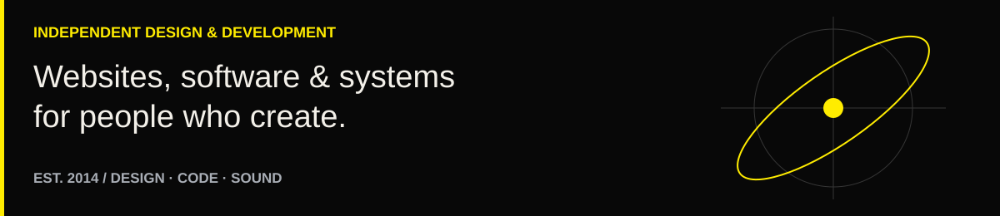
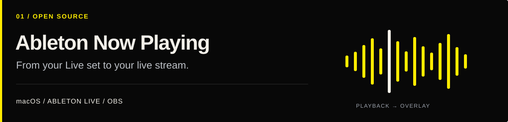
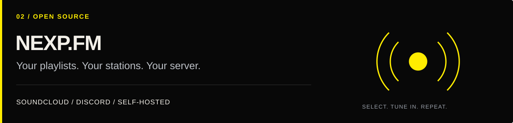
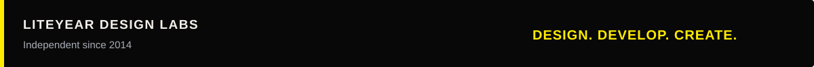

<a href="https://liteyeardesign.com"><picture><source media="(max-width: 600px)" srcset="./assets/studio-header-mobile-yellow.svg" /></picture></a>

**[STUDIO](https://liteyeardesign.com) &nbsp; / &nbsp; [OPEN SOURCE](#open-source) &nbsp; / &nbsp; [SELECTED WORK](#selected-work) &nbsp; / &nbsp; [BUILD WITH US](#build-with-us)**

## Built by a creator. Built to be used.

**Liteyear Design is an independent design and development studio founded in 2014.** We build websites, applications, broadcast tools, and automation for creators, communities, and digital brands.

## Open source

Free tools from the studio. Download a release, read the setup guide, or get into the code.

<a href="https://github.com/liteyear/ableton-now-playing"><picture><source media="(max-width: 600px)" srcset="./assets/ableton-now-playing-mobile-yellow.svg" /></picture></a>

Bring your **Ableton Live Session View clip titles into OBS** with a lightweight Mac app, a guided setup wizard, and a ready-styled overlay. Intel and Apple Silicon runtimes are included in the Mac download. No CSS editing or separate Node installation.

**[Download for Mac →](https://github.com/liteyear/ableton-now-playing/releases/latest)** &nbsp; · &nbsp; [Setup guide](https://github.com/liteyear/ableton-now-playing/blob/main/INSTALL.md) &nbsp; · &nbsp; [Source](https://github.com/liteyear/ableton-now-playing) &nbsp; · &nbsp; [Report an issue](https://github.com/liteyear/ableton-now-playing/issues)

macOS 11+ · Ableton Live 11+ · OBS Studio · MIT license

  

<a href="https://github.com/liteyear/NEXP.FM-2.0"><picture><source media="(max-width: 600px)" srcset="./assets/nexp-fm-mobile-yellow.svg" /></picture></a>

Turn **your own public SoundCloud playlists into Discord radio stations**. Browse stations with a dropdown or slash command, manage DJ permissions, and keep independent playback settings for each server. Includes guided configuration, saved station selection, and reconnect recovery.

**[Download NEXP.FM →](https://github.com/liteyear/NEXP.FM-2.0/releases/latest)** &nbsp; · &nbsp; [Setup guide](https://github.com/liteyear/NEXP.FM-2.0/blob/main/SETUP.md) &nbsp; · &nbsp; [Source](https://github.com/liteyear/NEXP.FM-2.0) &nbsp; · &nbsp; [Report an issue](https://github.com/liteyear/NEXP.FM-2.0/issues)

Self-hosted · Node.js + FFmpeg or Docker · MIT license

<strong>Already using an older NEXP.FM bot?</strong>

Both earlier versions have been consolidated into NEXP.FM 3.0. The maintained repository keeps the `NEXP.FM-2.0` URL so existing links continue to work. Start with the [migration guide](https://github.com/liteyear/NEXP.FM-2.0/blob/main/MIGRATION.md).

### From the lab

<!-- RELEASES:START -->
| Project | Latest release | Published |
| :--- | :--- | :--- |
| Ableton Now Playing | [v1.0.0](https://github.com/liteyear/ableton-now-playing/releases/tag/v1.0.0) | September 17, 2026 |
| NEXP.FM | [v3.0.1](https://github.com/liteyear/NEXP.FM-2.0/releases/tag/v3.0.1) | September 17, 2026 |

Public release data checked September 24, 2026 (UTC). Refreshed daily; the last successful snapshot stays visible if a refresh is unavailable.
<!-- RELEASES:END -->

## Selected work

Alongside our public tools, we design and develop websites for independent media, artists, and organizations.

| Project | What we built | Explore |
| :--- | :--- | :--- |
| **Jason Abadi** | An editorial and media platform connecting films, writing, radio, and community. | [jasonabadi.com ↗](https://jasonabadi.com) |
| **Nebulab Media** | A shared home for independent creative projects across music, streaming, and media. | [nebulabmedia.com ↗](https://nebulabmedia.com) |
| **Team Martell Clout** | An artist website bringing music, identity, and embedded listening together. | [teammartellclout.com ↗](https://teammartellclout.com) |
| **IM Workshops** | A public website for workshops, program information, and downloadable resources. | [imworkshops.me ↗](https://imworkshops.me) |

Client and production source code stays private. Public tools and their documentation are available in the repositories linked above.

## Studio capabilities

| Design & web | Software & automation | Audio & community |
| :--- | :--- | :--- |
| Visual identity and interface design | Custom applications and API integrations | OBS tools and stream overlays |
| Responsive websites and publishing | Scheduled workflows and deployment | Discord bots and station systems |
| WordPress, WooCommerce, Shopify | Node.js, JavaScript, Java | FFmpeg, audio pipelines, RSS |

**Our approach:** make the interface clear, keep the moving parts manageable, and document how to use what we build. Our public tools include setup instructions and source code so people can run and adapt them themselves.

<strong>Contribute, request a feature, or get support</strong>

- **Using a tool?** Start with its setup guide and release notes.
- **Found a bug?** Open an issue in that project's repository. Include your operating system, app version, and steps to reproduce it. Remove tokens and personal data from logs.
- **Have an improvement?** Open an issue to discuss it, or submit a focused pull request.
- **Building something commercial?** Visit the studio for custom design and development.

## Build with us

Need a website, a custom application, or a better way to run your creative work? Bring us the project.

**[Visit Liteyear Design →](https://liteyeardesign.com)** &nbsp; · &nbsp; [Meet Jason](https://jasonabadi.com) &nbsp; · &nbsp; [Browse all repositories](https://github.com/liteyear?tab=repositories)

 

